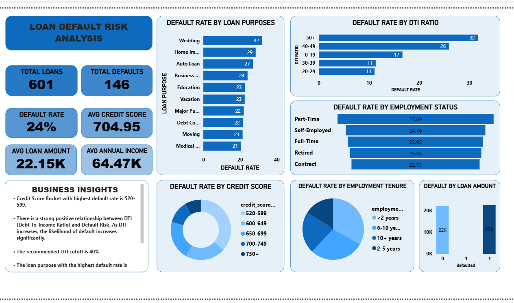

# Loan Default Risk Analysis Using SQL & Power BI

## Project Overview

This project analyzes loan application and borrower data to identify
patterns associated with loan defaults and provide insights that can
support credit risk assessment and lending decisions.

SQL Server was used to analyze the underlying loan and borrower data,
while Power BI was used to transform the analysis into an interactive
credit risk dashboard.

## Power BI Dashboard

## Key Findings

### 1. Overall Loan Default Rate

- The analysis covered **601 loan applications**, of which **146 resulted in defaults**.
- This represents an overall default rate of approximately **24%**.

### 2. Credit Score and Default Risk

- Borrowers within the **520–599 credit score range recorded the highest default rate** among the credit score groups analyzed.
- This suggests that borrowers with lower credit scores may present a higher level of default risk compared with borrowers in higher credit score categories.
- Credit score can therefore serve as an important factor when evaluating borrower credit risk.

### 3. Debt-to-Income (DTI) Ratio and Default Risk

- Default rates increased as borrowers' DTI ratios reached higher levels.
- Borrowers with a **DTI ratio of 50% or higher recorded the highest default rate at approximately 32%**.
- The **40–49% DTI group recorded a default rate of approximately 26%**.
- These results suggest an association between higher debt burden and increased default risk.

### 4. Loan Purpose and Default Risk

- Default rates varied considerably across different loan purposes.
- **Wedding loans recorded the highest default rate at approximately 32%**, followed by:
  - Home Improvement – **29%**
  - Auto Loan – **27%**
  - Business – **24%**
  - Education – **23%**
  - Vacation – **23%**
- This indicates that loan purpose may be an additional factor worth considering when assessing borrower risk.

### 5. Employment Status and Default Risk

- Default rates differed across employment-status categories.
- **Part-time borrowers recorded the highest default rate at approximately 27.69%**.
- This was followed by:
  - Self-Employed – **24.76%**
  - Full-Time – **23.93%**
  - Retired – **23.33%**
  - Contract – **22.73%**
- The results suggest that employment status may provide additional context when evaluating borrower risk.

### 6. Employment Tenure and Default Risk

- Borrowers with **less than 2 years of employment recorded the highest default rate at 34.52%**.
- Borrowers with **2–5 years of employment recorded the lowest default rate at 16.44%**.
- The 6–10 years group recorded a **30.00%** default rate, while borrowers with 10+ years recorded **22.99%**.
- These results suggest that employment tenure may be associated with differences in default risk, particularly among borrowers with shorter employment histories.

### 7. Loan Amount and Default Status

- The average loan amount for defaulted loans was **22,571**, compared
  with **22,013** for non-defaulted loans.
- This represents a relatively small difference of **558** in average
  loan amount, with defaulted loans averaging approximately **2.5% more**
  than non-defaulted loans.
- Based on this descriptive analysis, there is **no substantial difference
  in average loan amount** between the defaulted and non-defaulted groups.
- This suggests that loan amount alone may not be a strong indicator of
  default risk in this dataset and should be considered alongside other
  borrower and loan characteristics.

## Business Recommendations

Based on the findings from the analysis, the following recommendations
could support credit risk assessment:

1. **Strengthen assessment of lower-credit-score borrowers**
   
   Borrowers with lower credit scores recorded higher default rates.
   Credit score should therefore remain an important component of
   borrower risk assessment.

2. **Pay closer attention to high-DTI borrowers**
   
   Borrowers with DTI ratios of 40% and above showed elevated default
   rates. Additional affordability and repayment-capacity checks could
   be considered for this segment.

3. **Consider employment stability**
   
   Borrowers with less than 2 years of employment recorded a relatively
   high default rate. Employment tenure could therefore be incorporated
   as an additional indicator when assessing repayment risk.

4. **Monitor higher-risk loan purposes**
   
   Loan purposes with consistently higher default rates may require
   additional assessment of the borrower's intended use of funds and
   repayment capacity.

5. **Use multiple risk indicators**
   
   Credit decisions should not rely on a single borrower characteristic.
   Combining credit score, DTI ratio, employment characteristics,
   loan purpose and other relevant borrower information can provide a
   more comprehensive view of credit risk.
